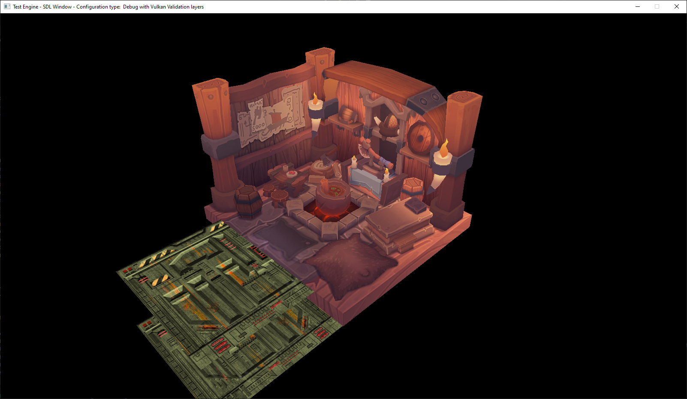

# Test-Engine

Game engine for training purposes.

## Objectives

* Learn/improve graphics programming and libraries
* Improve my C++ skills
* Try not to rely on external libraries too much
* Make the project modular so new features (ex: physics, audio, new graphics API) can be added and tested easily
* Learn and use CI (Continuous integration) and automated build tools and maintain the project cross-platform (for the moment, Windows and Linux, I don't own a Mac 😥).

## Project state

### Technologies

#### Languages:

* C++ 
* GLSL
* CMake

#### External libraries:

* SDL2
* SDL2_ttf
* stb_image
* assimp

### Features:

* Basic CMake for Windows and Linux builds, still not as simple to use as I would like
* Basic window handling using SDL
* Basic input/event handling using SDL
* Clunky software raycaster
* Meshes in Vulkan
* Basic scene
* Basic log system

## How to build

Read 
